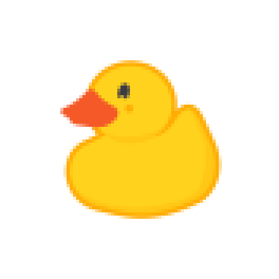

### Hi there 👋 nice to meet you
I'm **Max**, a Go enthusiast with a strong passion for backend engineering and computer networking. I love writing dev tools and improving my soft skills.
 
 

Try talking to ☝️, the rubber duck, if you are stuck on a bug

### Personal info

- 🔧 I use daily: .go, .py, .sh
- 🌱 Reviewing practical engineering advice and collecting the same at [niquet/practical-notes](https://github.com/niquet/practical-notes)
- 💬 Ask me about my dog, my passion for cheese and my opinions on german beer
- 📫 How to reach me: [on Twitter](https://twitter.com/node_env), [on LinkedIn](https://www.linkedin.com/in/niquet), [on a roll](https://www.youtube.com/watch?v=dQw4w9WgXcQ)

<!--
**niquet/niquet** is a ✨ _special_ ✨ repository because its `README.md` (this file) appears on your GitHub profile.

Here are some ideas to get you started:

- 🔭 I’m currently working on ...
- 🌱 I’m currently learning ...
- 👯 I’m looking to collaborate on ...
- 🤔 I’m looking for help with ...
- 💬 Ask me about ...
- 📫 How to reach me: ...
- 😄 Pronouns: ...
- ⚡ Fun fact: ...
-->

